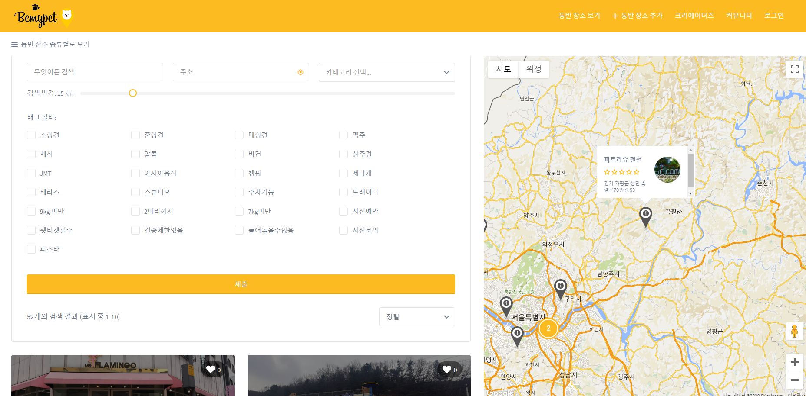
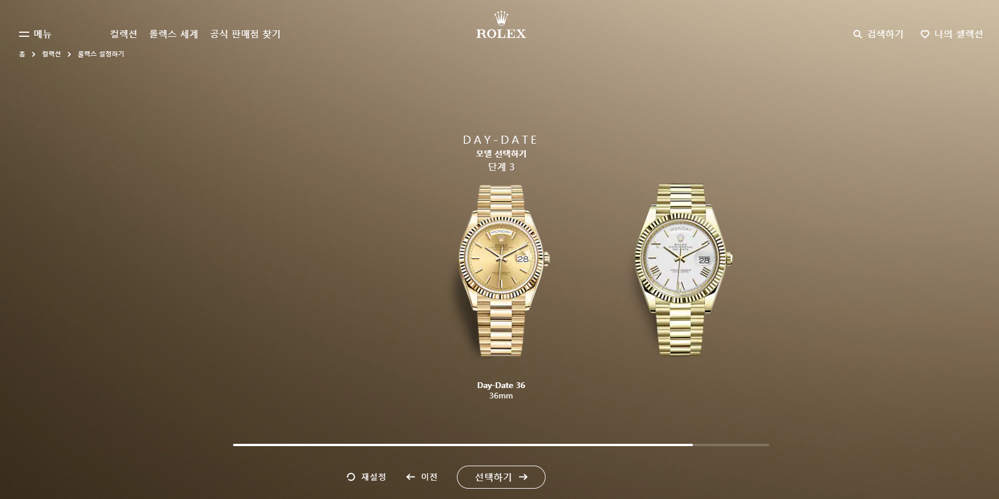
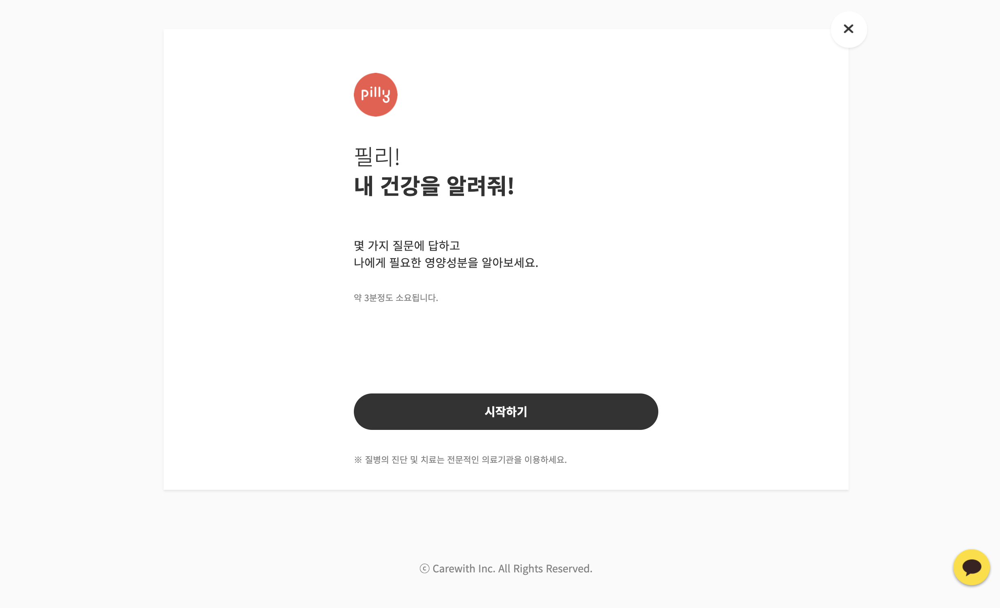
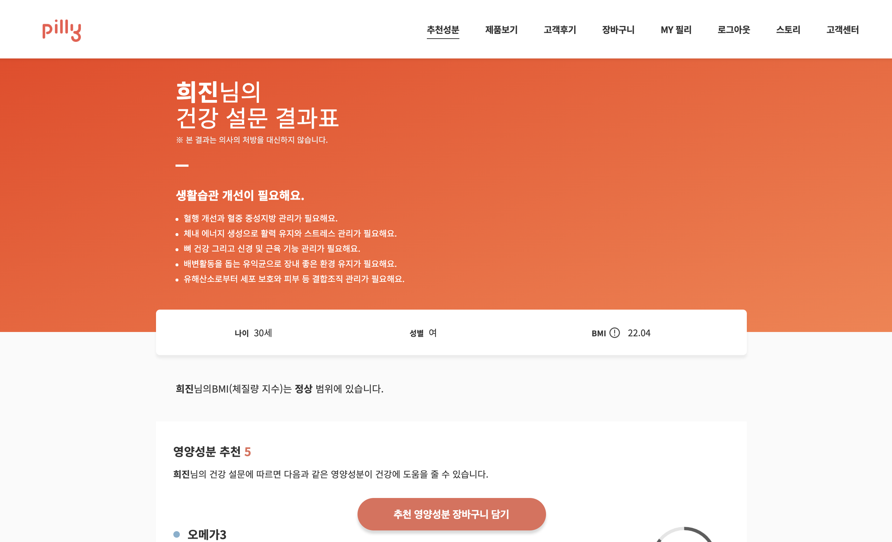
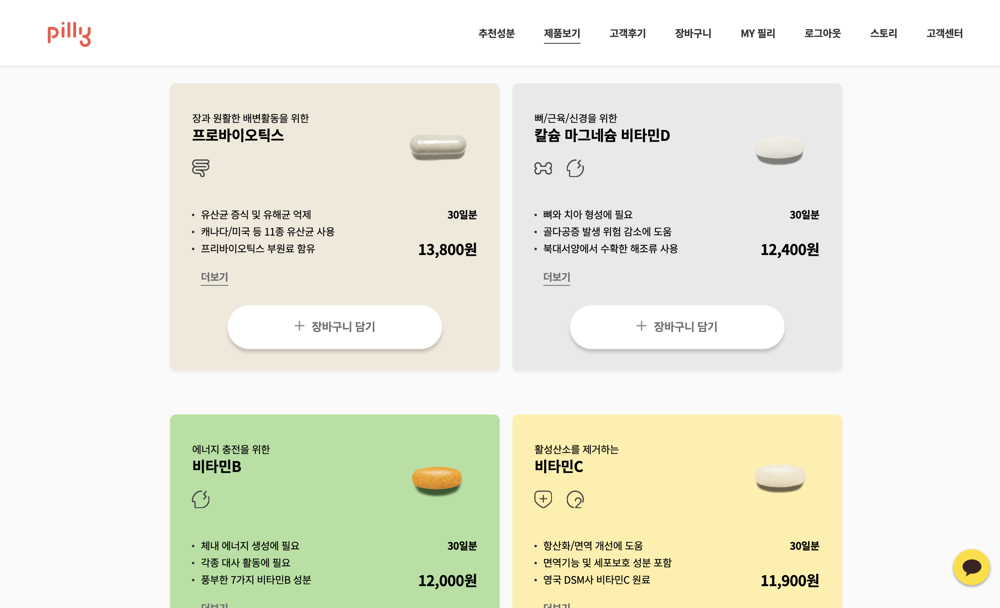

## 안녕하세요 
누구보다 포스트잇을 많이 가지고 있는 정희진입니다. 

## 저는 지금까지 항상 마감기한을 지켜냈습니다.  
과제 및 업무를 효율적으로 마치기 위해 체크리스트를 만들어 이행함으로써, 항상 기한을 지킬 수 있었습니다 
주도적인 환경을 선호하며, 로직을 잘 짜는것도 좋지만, 커뮤니케이션이 많아야 효율이 높다고 믿습니다. 
능숙한 분야가 아니더라도 업무에 필요하다면 적극적으로 탐색하여 최적의 결과를 낼 수 있도록 노력하고 있습니다. 

제가 맡게 되는 업무 하나하나 꼼꼼히 살피며 꾸준히 해 나가는 것으로 완성도 높은 성과를 증명하겠습니다. 

## 앞으로 
비즈니스의 가치를 높이는 개발자가 되는 것을 추구하고 있습니다. 

# SKILLS

### HTML/CSS
- 시맨틱 마크업을 준수합니다.

### Python
- 파이썬 언어의 기본적인 문법에 대해 알고 있습니다.
- 자료구조 및 알고리즘을 파이썬으로 공부했습니다.

### Django
- Django를 활용하여 웹 서비스를 개발했습니다. 
- 장고의 기능들을 배우며, REST API를 활용하여 프론트엔드와 협업하여 프로젝트를 진행했습니다

### Tooling
- Git을 사용하며 Git Flow 등의 개발 방법론 경험이 있습니다.

### DevOps
- AWS EC2, S3, RDS 등의 사용 경험이 있습니다.
- AWS를 서버로 사용하며,  EC2를 확장하고 로드밸런서를 통해 연결했습니다. 
- 직접 배포 및 Elastic Beanstalk를 통해 프로젝트를 배포한 경험이 있습니다. 
- 현재는 Docker를 공부하고 있습니다.

# WECODE
3/23 ~ 6/19 동안 백엔드 과정으로 위코드에서 공부했습니다.  
아래 프로젝트는 위코드에서 진행한 그룹 프로젝트 입니다.

## Project

### 비마이펫 프로젝트

- 반려견 동반으로 갈 수 있는 장소들을 한눈에 모아볼 수 있는 사이트
- 주요 기능
    - 장소, 상호명, 태그 등으로 검색
    - 방문했던 장소들의 평점과 좋아요 및 리뷰 기능

'첫 프로젝트 잘해보자!' 했는데 크롤링 3일차에 사이트가 리뉴얼중이었는지 멈춰버려서, 
엎어버린 비운의 0.5 프로젝트이다..

### 롤렉스 프로젝트

- 시계 브랜드
- 주요 기능
  - 원하는 시계로 커스터마이징
  - 시계 컬렉션 모아보기
  - 재료별로 필터 기능
  - 나의 셀렉션(좋아요 기능)
- 팀 구성
  - 프론트엔드 3명, 백엔드 3명
  - [프론트엔드 Github](https://github.com/wecode-bootcamp-korea/Rolex-frontend)
  - [백엔드 Github](https://github.com/wecode-bootcamp-korea/Rolex-backend)
- 적용 기술(백엔드)
  - Python
  - Bcrypt
  - JWT
  - Django
  - MySQL
  - AWS EC2/RDS
  - Trello

### 내가 담당한 부분
(DB 모델링과 크롤링은 공동으로 담당하였다.)
- 엔드포인트 구현
  - 회원가입
  - 로그인
  - 좋아요/좋아요 취소
  - 나의 셀렉션 목록

### 담당하지 않은 부분은
위코드 수료전까지 완성시키는게 목표!!
링크 -> [Github](https://github.com/pyheejin/rolex)

### Willy 프로젝트

- 설문조사를 통해서 필요한 영양제를 추천해주고 구매하는 웹사이트 Pilly clone
- 주요 기능
    - 설문조사로 질문에 따른 영양제 추천
    - 제품 구매
    - 정기구독
    - 소셜로그인
    - 챗봇
- 팀 구성
  - 프론트엔드 3명, 백엔드 3명
  - [프론트엔드 Github](https://github.com/wecode-bootcamp-korea/Willy-frontend)
  - [백엔드 Github](https://github.com/wecode-bootcamp-korea/Willy-backend)
- 적용 기술(백엔드)
  - Python
  - Bcrypt
  - JWT
  - Django
  - MySQL
  - AWS EC2/RDS
  - Trello

### 내가 담당한 부분
(DB 모델링과 크롤링은 공동으로 담당하였다.)
- 엔드포인트 구현
  - 고객후기 리스트
  - 고객후기 상세페이지
  - 포인트몰 리스트
  - 포인트몰 상세페이지
  - 회원/비회원 구분해서 장바구니 담기