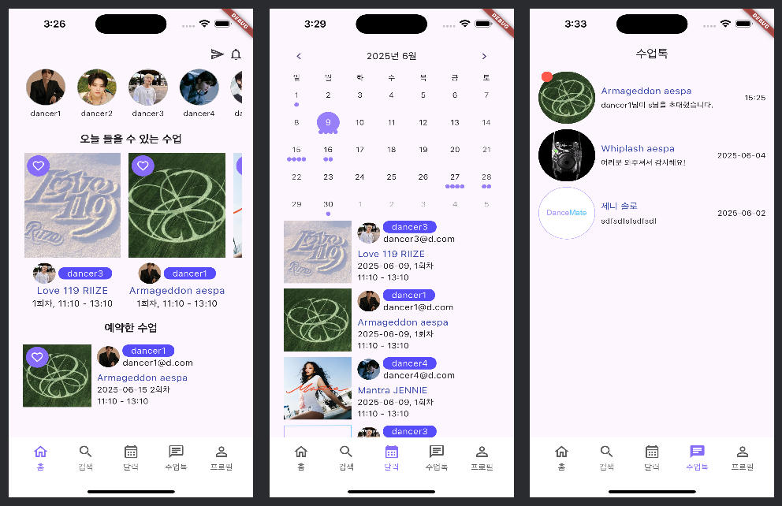
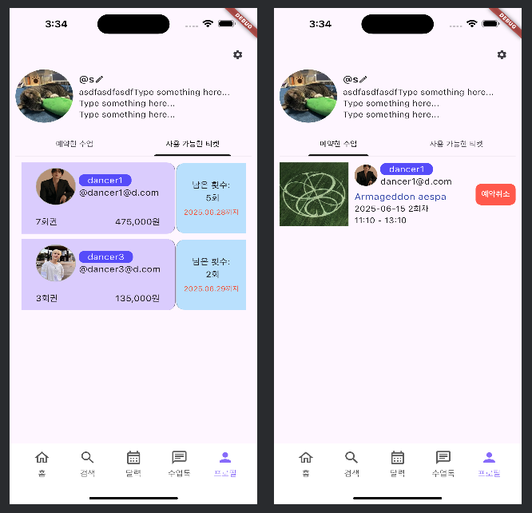
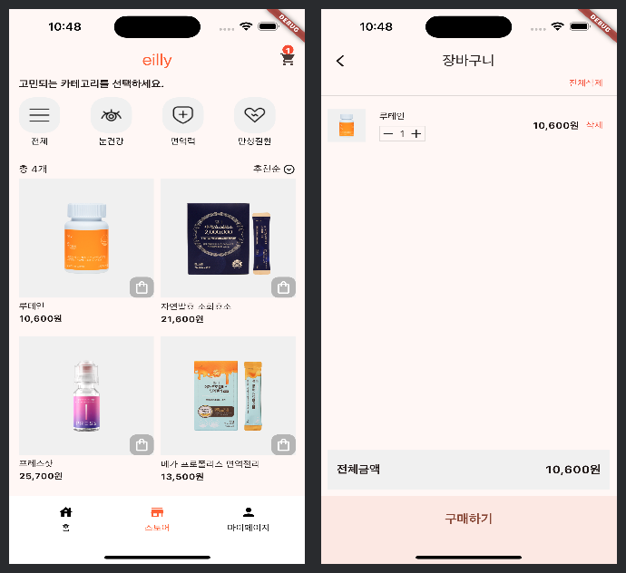
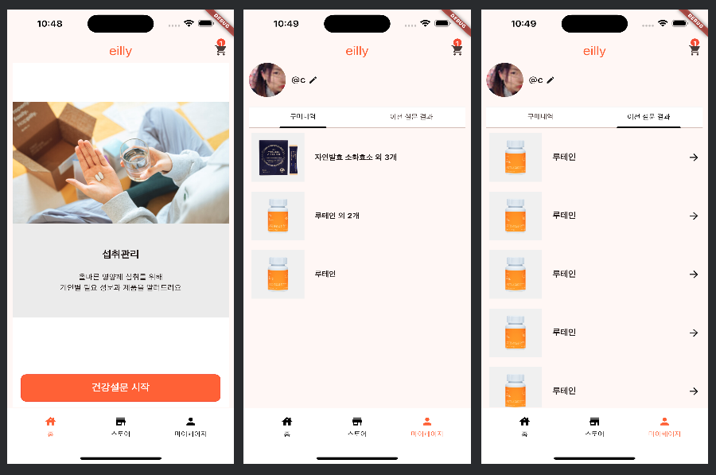

## 자기소개
> 키워드 : 책임, 끈기, 소통

주어진 일에 최선을 다하고, 스스로 고민해서 찾은 답에 ‘책임’감 있는 사람이 되고자 합니다. 
새로운 환경에서도 ‘끈기’ 있게 ‘소통’하며 회피하지 않고 문제 해결을 위해 노력합니다.

메모하는 습관은 저를 계획적인 사람이 되도록 이끌었습니다. 
과제 및 업무를 효율적으로 마치기 위해 체크리스트를 만들고,
문제마다 붙여놓은 포스트잇을 마감기한 내에 해결할 수 있었습니다.

파이썬 백엔드로 개발에 뛰어들어 백오피스 및 앱 api 위주로 개발하였으며,  
최근에는 앱을 출시해서 운영해 보고자 플러터를 공부하고 있습니다.

## 기술스택

Python, FastAPI, Flask, Django, MySQL, SQLAlchemy, Flutter

## 프로젝트
### 댄스메이트 (2024.12 ~ 진행중)

> 자유롭게 춤을 배우고, 가르치고 싶어하는 사람들을 위한 플랫폼

- 주요기능
  - 수업 등록 및 관리
  - 티켓 구매 및 수업 예약
  - 나의 티켓과 예약 내역 관리
  - 수업 예약시 자동으로 톡방에 초대

- 개발환경
  - Tools : Git, GitHub
  - Front-end : Flutter
  - Back-end : Python, FastAPI

### 일리 (2024.10.24 ~ 2024.11.25)
eilly, 영양제 추천 사이트 '필리' 클론코딩

> 맞춤 영양제 추천

- 주요기능
  - 설문조사 결과로 영양제 추천
  - 영양제 장바구니 담기 및 구매
  - 영양제 구매내역
  - 진행했던 설문조사 결과 내역

- 개발환경
  - Tools : Git, GitHub
  - Front-end : Flutter

## 경력

**주식회사 원루프랩**  
*2024.12 - 재직중*  
공유 오피스 관리

**주식회사 한국미용데이터**  
*2023.03 - 2024.04 (1년 2개월)*  
미용실 매출 및 예약, 매장 관리 서비스  
뷰카 앱 서버 구축 및 API 개발

**데블록(Devlock)**  
*2020.11 - 2022.07 (1년 9개월)*  
서비스/어드민 api 개발 및 유지보수

**디에이웍스**  
*2020.07 - 2022.11 (5개월)*  
어드민 api 개발 및 유지보수

**백엔드 훈련과정(위코드 Wecode)**  
*2020.03 - 2022.06 (4개월)*  
백엔드 개발 훈련 수료
