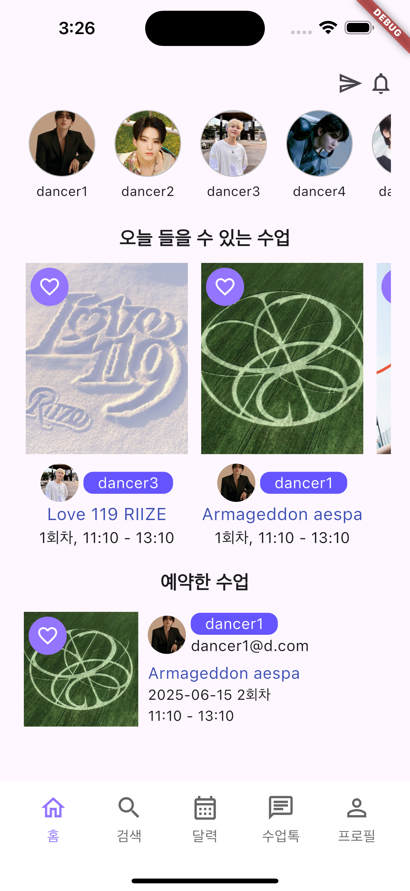
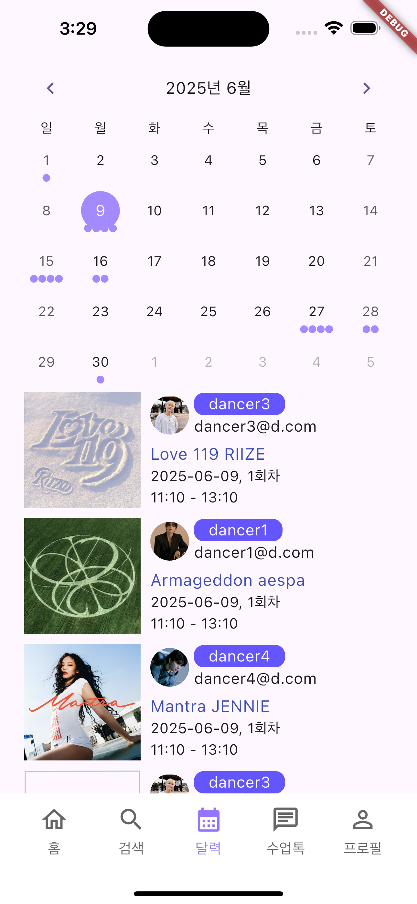
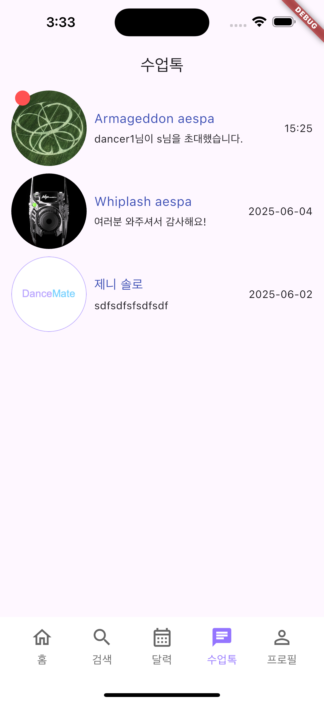
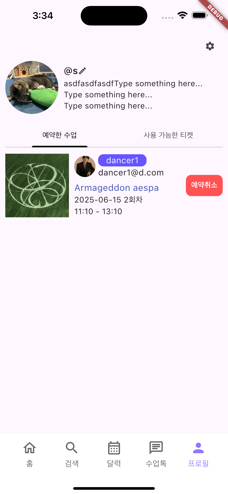
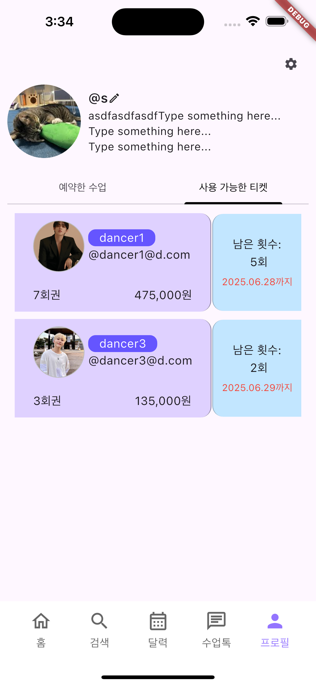

## 자기소개

> 키워드 : 책임, 끈기, 소통

주어진 일에 최선을 다하고, 스스로 고민해서 찾은 답에 ‘책임’감 있는 사람이 되고자 합니다. 
새로운 환경에서도 ‘끈기’ 있게 ‘소통’하며 문제 해결을 위해 노력합니다.

메모하는 습관은 저를 계획적인 사람이 되도록 이끌었습니다. 
과제 및 업무를 효율적으로 마치기 위해 체크리스트를 만들고,
문제마다 붙여놓은 포스트잇을 마감기한 내에 해결할 수 있었습니다.

## 기술스택

Python, FastAPI, Flask, Django, MySQL, SQLAlchemy, Flutter

## 프로젝트

### 뷰카 앱 (2023.03 ~ 2024.04)

> 미용실 매출 및 예약, 매장 관리 서비스

- 개발환경
  - Tools : Git, GitHub
  - Back-end : Python, FastAPI

- 역할
  - 프로젝트 구축
  - 매출관리, 예약관리(네이버 예약 연동) api 개발

### 댄스메이트 (2024.12 ~ 진행중)

> 자유롭게 춤을 배우고, 가르치고 싶어하는 사람들을 위한 플랫폼

- 주요기능
  - 수업 등록 및 관리
  - 티켓 구매 및 수업 예약
  - 나의 티켓과 예약 내역 관리

- 개발환경
  - Tools : Git, GitHub
  - Front-end : Flutter
  - Back-end : Python, FastAPI
