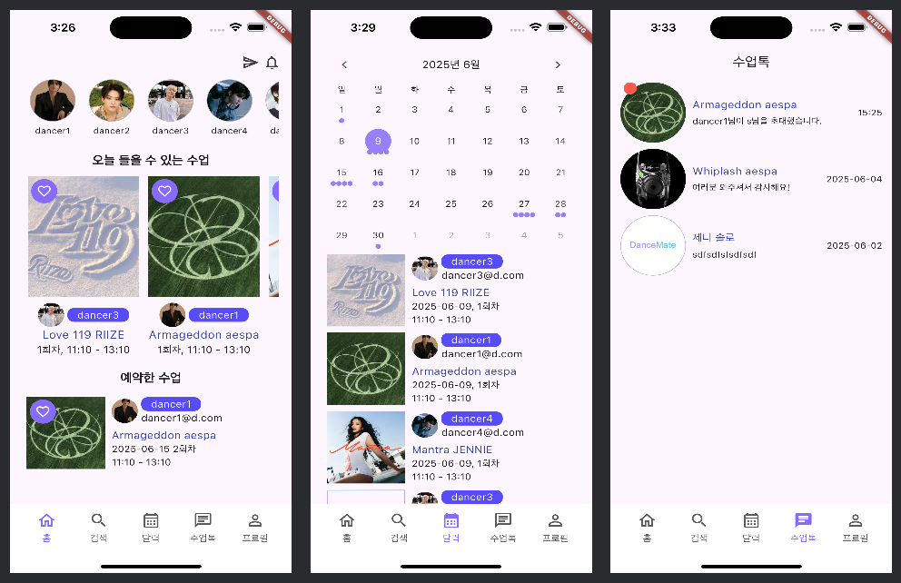
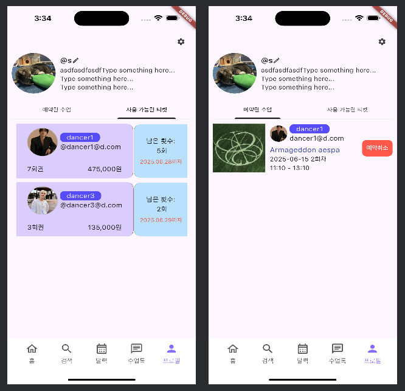
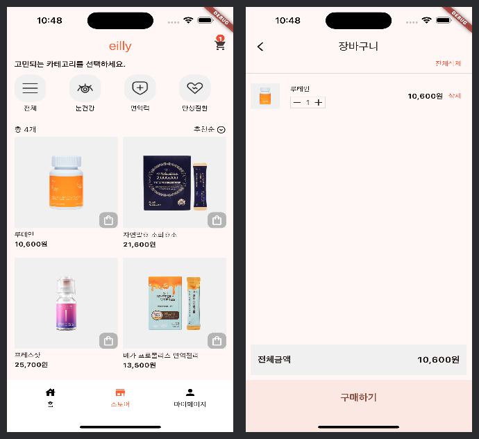
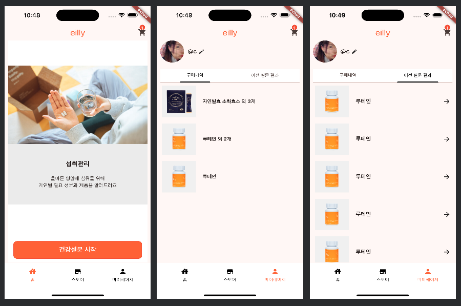
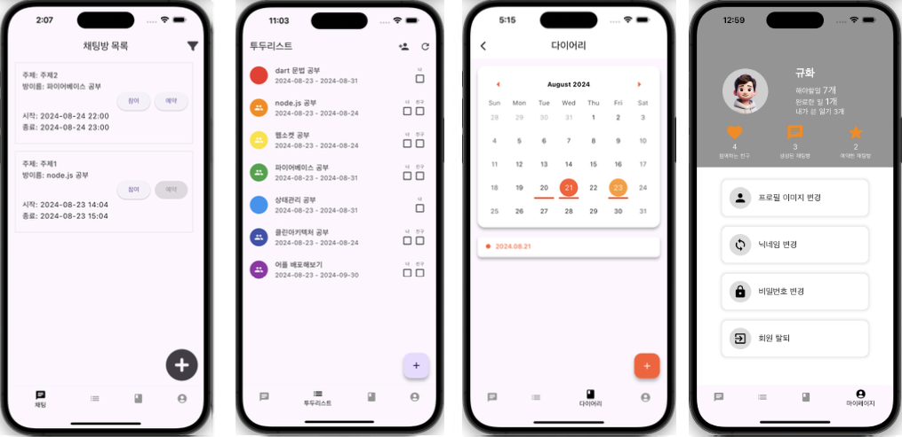
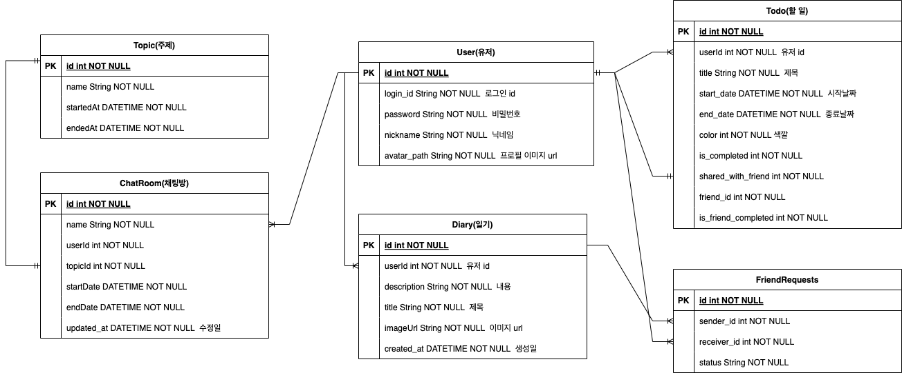

## 자기소개
> 키워드 : 책임, 끈기, 소통

Python 기반 백엔드 개발 경험을 보유한 서버 개발자입니다.  
실서비스 API 설계·구현과 DB 성능 최적화에 강점이 있으며, 다양한 협업 경험을 통해 문제 해결과 소통 역량을 함께 갖추고 있습니다.

주어진 일에 최선을 다하고, 스스로 고민해서 찾은 답에 ‘책임’감 있는 사람이 되고자 합니다. 
새로운 환경에서도 ‘끈기’ 있게 ‘소통’하며 회피하지 않고 문제 해결을 위해 노력합니다.

메모하는 습관은 저를 계획적인 사람이 되도록 이끌었습니다. 
과제 및 업무를 효율적으로 마치기 위해 체크리스트를 만들고,
문제마다 붙여놓은 포스트잇을 마감기한 내에 해결할 수 있었습니다.

파이썬 백엔드로 개발에 뛰어들어 백오피스 및 앱 api 위주로 개발하였으며,  
최근에는 앱을 출시해서 운영해 보고자 플러터를 공부하고 있습니다.

## 기술스택

Python, FastAPI, Flask, Django, MySQL, SQLAlchemy, Flutter

## 개인 프로젝트
### 댄스메이트 (2024.12 ~ 진행중)

> 자유롭게 춤을 배우고, 가르치고 싶어하는 사람들을 위한 플랫폼

- 주요기능
  - 수업 등록 및 관리
  - 티켓 구매 및 수업 예약
  - 나의 티켓과 예약 내역 관리
  - 수업 예약시 자동으로 톡방에 초대

- 개발환경
  - Tools : Git, GitHub
  - Front-end : Flutter
  - Back-end : Python, FastAPI

- 본인 역할
  - 백엔드 API 개발 및 Flutter 클라이언트 개발
  - Riverpod 상태 관리 및 UI/UX 구현 경험

### 일리 (2024.10.24 ~ 2024.11.25)
eilly, 영양제 추천 사이트 '필리' 클론코딩

> 맞춤 영양제 추천

- 주요기능
  - 설문조사 결과로 영양제 추천
  - 영양제 장바구니 담기 및 구매
  - 영양제 구매내역
  - 진행했던 설문조사 결과 내역

- 개발환경
  - Tools : Git, GitHub
  - Front-end : Flutter

- 본인 역할
  - 백엔드 API 개발 및 Flutter 클라이언트 개발
  - Riverpod 상태 관리 및 UI/UX 구현 경험

## 팀 프로젝트
### 투두메이트 (2024.08.12 ~ 2024.08.26)

> 친구와 함께 투두리스트를 작성하고 완료 여부를 공유하며 동기부여 제공

- 주요기능
  - 유저: 로그인, 회원가입
  - 채팅: 웹소켓 실시간 소통, 채팅방 알림, 채팅방 예약 생성 및 자동종료, 주제별 필터
  - 다이어리: 캘린더에 날짜별 일기 작성/수정/삭제, 사진 추가
  - 마이페이지: 프로필 이미지/닉네임/비밀번호 변경, 회원 탈퇴
  - 투두리스트: 투두리스트 생성/수정/삭제, 투두 완료시 알림 전송

- 개발환경
  - Tools : Git, GitHub
  - Front-end : Flutter

- 본인 역할
  - Riverpod 상태 관리 및 UI/UX 구현 경험
  - 채팅 리스트 화면
  - 채팅방 상세 화면
  - 채팅방 예약 및 참여 기능
  - 채팅방 알림 기능
  - 채팅방 목록 필터
  - ERD 설계

## 경력

**엘리스 플러터 앱 개발자 과정**  
*2024.07 - 2024.12 (1년 2개월)*  
미용실 매출 및 예약, 매장 관리 서비스  
- 플러터 개발 훈련 수료(Flutter)

 

**주식회사 한국미용데이터**  
*2023.03 - 2024.04 (1년 2개월)*  
미용실 매출 및 예약, 매장 관리 서비스  
- 뷰카 앱 서버 구축 및 API 개발(Python, FastAPI)
- DB 설계

 

**데블록(Devlock)**  
*2020.11 - 2022.07 (1년 9개월)*  
- 서비스/어드민 api 개발 및 유지보수(Python, Flask)

 

**디에이웍스**  
*2020.07 - 2022.11 (5개월)*  
- 어드민 api 개발 및 유지보수(Python, Django)

 

**백엔드 훈련과정(위코드 Wecode)**  
*2020.03 - 2022.06 (4개월)*  
- 백엔드 개발 훈련 수료(Python, Flask)
