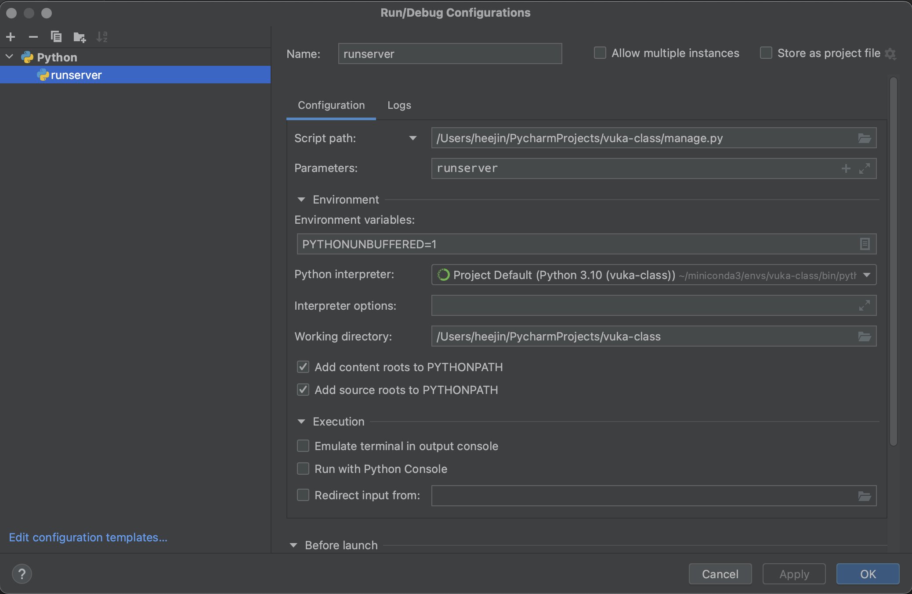

### 파이참 configurations



## gitignore
[gitignore site](https://www.gitignore.io/)
- macOS, Django, Python, PyCharm깃허브에 노출되지 않아야 할 것을 구분하기 위해서 .gitignore 파일을 생성해서 관리해야 한다. 개발환경만 입력하면 자동으로 생성해준다.


## 설치
```commandline
pip install django
```

## 프로젝트 생성
```commandline
django-admin startproject myproject
```
```commandline
cd myproject
```

## corsheaders
백엔드가 만드는 api 서버에는 페이지가 없지만 보안을 위해 설정해야 한다. (port 번호가 다르면 도메인이 같아도 다른 서버로 인식하기 때문에 cross domain 에러를 방지하기 위해 사용)

1. django-cors-headers 플러그인 설치
```commandline
pip install django-cors-headers
```
2. settings.py 에 추가
```python
INSTALLED_APPS = [
#   'django.contrib.admin',
#   'django.contrib.auth',
  'django.contrib.contenttypes',
  'django.contrib.sessions',
  'django.contrib.messages',
  'django.contrib.staticfiles',
  'corsheaders', # here
]

MIDDLEWARE = [
  'django.middleware.security.SecurityMiddleware',
  'django.contrib.sessions.middleware.SessionMiddleware',
  'django.middleware.common.CommonMiddleware',
#   'django.middleware.csrf.CsrfViewMiddleware',
#   'django.contrib.auth.middleware.AuthenticationMiddleware',
  'django.contrib.messages.middleware.MessageMiddleware',
  'django.middleware.clickjacking.XFrameOptionsMiddleware',
  'corsheaders.middleware.CorsMiddleware', # here
]

# settings.py 마지막에 CORS 설정값 추가
CORS_ORIGIN_ALLOW_ALL=True
CORS_ALLOW_CREDENTIALS = True
CORS_ALLOW_METHODS = (
    'DELETE',
    'GET',
    'OPTIONS',
    'PATCH',
    'POST',
    'PUT',
)
CORS_ALLOW_HEADERS = (
    'accept',
    'accept-encoding',
    'authorization',
    'content-type',
    'dnt',
    'origin',
    'user-agent',
    'x-csrftoken',
    'x-requested-with',
)
```

## settings.py 설정
```python
# 애플리케이션 등록
INSTALLED_APPS = [
    'django.contrib.admin',
    'django.contrib.auth',
    'django.contrib.contenttypes',
    'django.contrib.sessions',
    'django.contrib.messages',
    'django.contrib.staticfiles',
    # here
    'application.apps.ApplicationConfig',
]


# SQLite
DATABASES = {
    'default': {
        'ENGINE': 'django.db.backends.sqlite3',
        'NAME': os.path.join(BASE_DIR, 'db.sqlite3'),
    }
}

# PostgreSQL
# pip install psycopg2
DATABASES = {
    'default': {
        'ENGINE': 'django.db.backends.postgresql_psycopg2',
        'NAME': 'django_test',
        'USER': 'django_user',
        'PASSWORD': 'django_pass',
        'HOST': 'localhost',
        'PORT': '',
    }
}

APPEND_SLASH = False

LANGUAGE_CODE = 'ko-kr'
TIME_ZONE = 'Asia/Seoul'

TEMPLATES = [
    {
        'BACKEND': 'django.template.backends.django.DjangoTemplates',
        'DIRS': [os.path.join(BASE_DIR, 'templates')],
        'APP_DIRS': True,
        'OPTIONS': {
            'context_processors': [
                'django.template.context_processors.debug',
                'django.template.context_processors.request',
                'django.contrib.auth.context_processors.auth',
                'django.contrib.messages.context_processors.messages',
            ],
        },
    },
]


STATIC_URL = '/static/'
STATIC_ROOT = os.path.join(BASE_DIR, 'static')
STATICFILES_DIRS = [
    os.path.join(BASE_DIR, 'static'),
]
```

## requrirements 생성/설치
```commandline
pip freeze > requirements.txt
```
```commandline
pip install -r requirements.txt
```

## IP 셋팅
- ip 확인 : 터미널에 ifconfig (ex : en0의 inet - inet 10.58.0.209)
```python
ALLOWED_HOSTS = ['10.58.0.209', '10.58.0.209:8000']
```

## 실행
```commandline
python manage.py runserver
```
