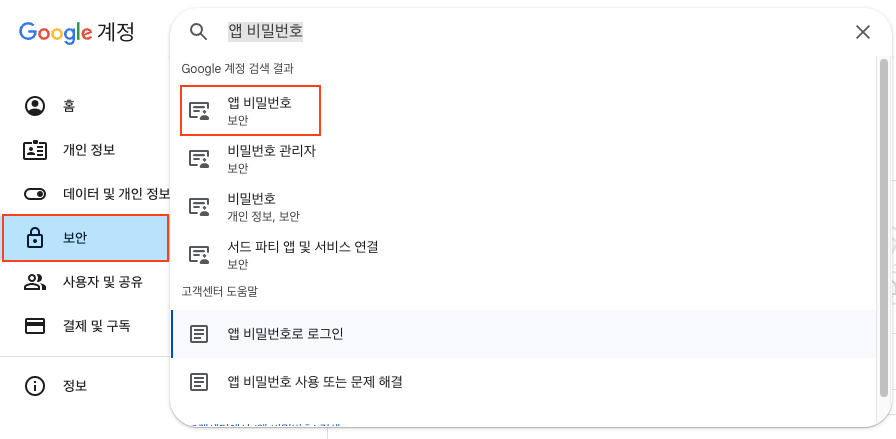
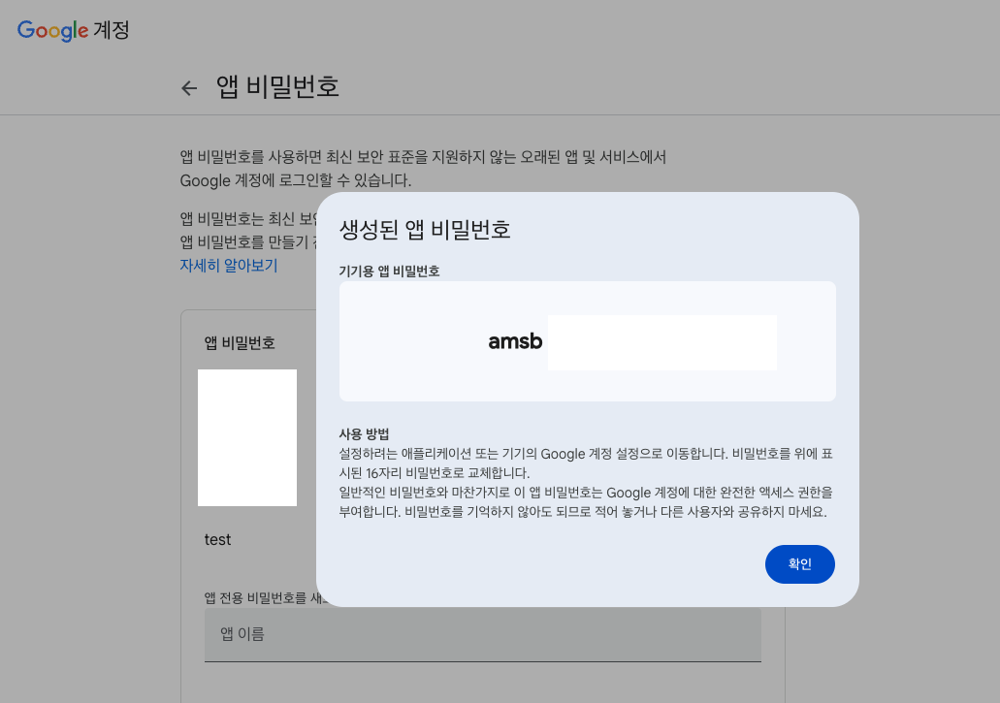

### gmail 보안 설정


구글 계정관리 > 보안 > 앱 비밀번호
앱 이름을 입력하고 만들기 버튼을 누르면 16자리 코드가 나오는데 추후에 코드에서 로그인 비밀번호로 사용되니 기록하되 공유되지 않도록 주의

### 코드

```python
import smtplib

from email.mime.text import MIMEText
from email.mime.multipart import MIMEMultipart

from config.config import EMAIL, PASSWORD


class SMTP:
    def __init__(self):
        self.email = EMAIL
        self.password = PASSWORD

    def send_email(self, to_email, msg):
        with smtplib.SMTP('smtp.gmail.com') as connection:
            message = MIMEMultipart()

            # 메일 제목
            message['Subject'] = '메일 제목'

            # 메일 본문 내용
            content = MIMEText(msg, 'plain')
            message.attach(content)

            # Transport Layer Security : 메시지 암호화
            connection.starttls()

            # 이메일 로그인
            connection.login(user=self.email, password=self.password)
            connection.sendmail(
                from_addr=self.email,
                to_addrs=to_email,
                msg=message.as_string(),
            )

smtp = SMTP()
smtp.send_email(to_email='받는 사람 이메일', msg='메일 본문 내용')
```
