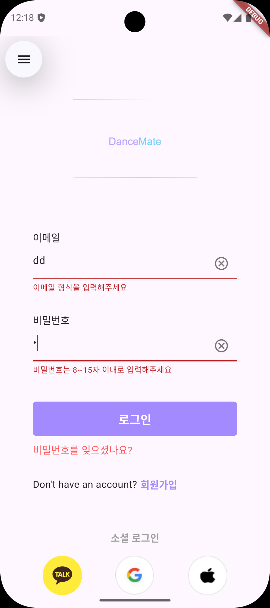

## validation.dart
```dart
// 이메일 정규식
bool isEmailValid(String value) {
  RegExp regExp = RegExp(
    r'^[a-zA-Z0-9.+-]+@[a-zA-Z0-9-]+\.[a-zA-Z0-9-.]+$',
  );
  return regExp.hasMatch(value);
}

// 비밀번호 정규식
bool isPasswordValid(String value) {
  // 특수문자, 문자, 숫자 포함해서 8자 이상 15자 이내
  RegExp regExp = RegExp(
    r'^(?=.*[a-zA-z])(?=.*[0-9])(?=.*[$`~!@$!%*#^?&\\(\\)\-_=+]).{8,15}$',
  );
  return regExp.hasMatch(value);
}
```

```dart
import 'dart:convert';

import 'package:dancemate_app/database/model.dart';
import 'package:dancemate_app/widgets/validation.dart';
import 'package:dancemate_app/google_sign_in_service.dart';
import 'package:dancemate_app/provider/main_tap_provider.dart';
import 'package:dancemate_app/provider/user_provider.dart';
import 'package:dancemate_app/screens/search_user_screen.dart';
import 'package:dancemate_app/screens/signup_screen.dart';
import 'package:dancemate_app/widgets/error.dart';
import 'package:flutter_dotenv/flutter_dotenv.dart';
import 'package:flutter_riverpod/flutter_riverpod.dart';
import 'package:dancemate_app/screens/main_tab_screen.dart';
import 'package:flutter/material.dart';
import 'package:flutter_secure_storage/flutter_secure_storage.dart';
import 'package:kakao_flutter_sdk/kakao_flutter_sdk_talk.dart';
import 'package:kakao_flutter_sdk/kakao_flutter_sdk_template.dart';
import 'package:sign_in_with_apple/sign_in_with_apple.dart';

class LoginScreen extends ConsumerStatefulWidget {
  const LoginScreen({
    super.key,
  });

  @override
  ConsumerState<LoginScreen> createState() => _LoginScreenState();
}

class _LoginScreenState extends ConsumerState<LoginScreen> {
  final TextEditingController emailController = TextEditingController();
  final TextEditingController passwordController = TextEditingController();

  // 이메일 유효성 상태 변수
  bool isValidEmail = true;
  // 이메일 필드 입력 여부 추적 변수
  bool isEmailFieldTouched = false;

  // 비밀번호 유효성 상태 변수
  bool isValidPassword = true;
  // 비밀번호 필드 입력 여부 추적 변수
  bool isPasswordFieldTouched = false;

  @override
  void initState() {
    super.initState();
    emailController.addListener(_validateEmail);
    passwordController.addListener(_validatePassword);
  }

  void _validateEmail() {
    isEmailFieldTouched = true;
    final bool currentValidation = isEmailValid(emailController.text);

    setState(() {
      isValidEmail = currentValidation;
    });
  }

  void _validatePassword() {
    isPasswordFieldTouched = true;
    final bool currentValidation = isPasswordValid(passwordController.text);

    setState(() {
      isValidPassword = currentValidation;
    });
  }

  @override
  void dispose() {
    emailController.removeListener(_validateEmail);
    passwordController.removeListener(_validatePassword);
    emailController.dispose();
    passwordController.dispose();
    super.dispose();
  }

  void onClearTap(TextEditingController controller) {
    controller.clear();
  }

  void onLoginTap() async {
    // 로그인 버튼 클릭 시 이메일, 비밀번호 유효성 검사 실행
    _validateEmail();
    _validatePassword();

    if (!isValidEmail || !isValidPassword) {
      errorAlert(context, '이메일 혹은 비밀번호를 확인해주세요.');
      return;
    }

    List<dynamic> args = [
      emailController.text,
      passwordController.text,
    ];
    final result = await ref.watch(postUserLoginProvider(args).future);

    if (result['result_code'] == 200) {
      const storage = FlutterSecureStorage();
      await storage.delete(key: 'login');

      final userId = result['user_id'];
      final userType = result['type'];
      final accessToken = result['access_token'];

      final payload = jsonEncode({
        'userId': userId,
        'userType': userType,
        'email': emailController.text,
        'access_token': accessToken,
      });

      await storage.write(
        key: 'login',
        value: payload,
      );

      ref.read(mainTapProvider.notifier).update((state) => 0);

      Navigator.of(context).push(
        MaterialPageRoute(
          builder: (context) => const MainNavigationScreen(),
        ),
      );
    } else {
      errorAlert(context, result['result_msg']);
    }
  }

  void onSocialLoginTap(int method) async {
    await dotenv.load();
    final String privateKey = [
      dotenv.env['APPLE_PRIVATE_KEY_LINE1']!,
      dotenv.env['APPLE_PRIVATE_KEY_LINE2']!,
      dotenv.env['APPLE_PRIVATE_KEY_LINE3']!,
      dotenv.env['APPLE_PRIVATE_KEY_LINE4']!,
      dotenv.env['APPLE_PRIVATE_KEY_LINE5']!,
      dotenv.env['APPLE_PRIVATE_KEY_LINE6']!,
    ].join('\\n');

    if (method == 2) {
      final GoogleSignInService signInService = GoogleSignInService();
      final account = await signInService.signInWithGoogle();
      if (account != null) {
        if (account.additionalUserInfo != null) {
          final isNewUser = account.additionalUserInfo!.isNewUser;
          final credential = '${account.credential!.token}';

          final userData = account.additionalUserInfo!.profile;
          final email = userData!['email'];
          final password = '${account.credential!.token}';
          final nickname = userData['given_name'];
          final name = userData['name'];
          final imageUrl = userData['picture'];
          const phone = '';
          const introduction = '';
          if (isNewUser) {
            // 신규 회원일 경우에만 회원가입 진행
            UserModel user = UserModel(
              type: 1,
              method: method,
              email: email,
              password: password,
              nickname: nickname,
              name: name,
              phone: phone,
              introduction: introduction,
              imageUrl: imageUrl,
              appleToken: '',
              appleIdentifier: '',
            );

            final result = await ref.watch(postUserJoinProvider(user).future);
            if (result['result_code'] == 200) {
              Navigator.of(context).push(
                MaterialPageRoute(
                  builder: (context) => const MainNavigationScreen(),
                ),
              );
            } else {
              errorAlert(context, result['result_msg']);
            }
          } else {
            List<dynamic> args = [
              email,
              credential,
            ];
            final result = await ref.watch(postUserLoginProvider(args).future);

            if (result['result_code'] == 200) {
              ref.read(mainTapProvider.notifier).update((state) => 0);

              Navigator.of(context).push(
                MaterialPageRoute(
                  builder: (context) => const MainNavigationScreen(),
                ),
              );
            }
          }
        }
      }
    } else if (method == 3) {
      // 휴대폰에 카카오톡이 깔려있는지 bool 값으로 반환해주는 함수
      bool installed = await isKakaoTalkInstalled();

      // 깔려있다면 UserApi.instance.loginWithKakaoTalk() 으로 카카오톡 오픈 후 동의
      // 깔려있지 않다면 UserApi.instance.loginWithKakaoAccount() 으로 웹을 통한 인증
      OAuthToken token = installed
          ? await UserApi.instance.loginWithKakaoTalk()
          : await UserApi.instance.loginWithKakaoAccount();

      // 위 두가지 방법으로 인증 로그인 성공 후 유저 정보 가져오기
      User user = await UserApi.instance.me();

      final id = user.id.toString();
      final email = user.kakaoAccount!.email.toString();
      final nickname = user.properties!['nickname'].toString();
      final imageUrl = user.properties!['profile_image'].toString();

      // 서버로 유저 정보 전송하여 데이터베이스에 저장하기
      UserModel userData = UserModel(
        type: 1,
        method: method,
        email: email,
        password: id,
        nickname: nickname,
        name: nickname,
        phone: '',
        introduction: '',
        imageUrl: imageUrl,
        appleToken: '',
        appleIdentifier: '',
      );

      try {
        final result = await ref.watch(postUserJoinProvider(userData).future);
        if (result['result_code'] == 200) {
          Navigator.of(context).push(
            MaterialPageRoute(
              builder: (context) => const MainNavigationScreen(),
            ),
          );
        } else {
          print(result['result_msg']);
          errorAlert(context, result['result_msg']);
        }
      } catch (e) {
        final resultCode = e.toString().split(' ')[1];
        if (resultCode == '207') {
          // 이미 가입된 이메일이면 로그인처리
          List<dynamic> args = [
            email,
            id,
          ];
          final loginResult =
              await ref.watch(postUserLoginProvider(args).future);

          if (loginResult['result_code'] == 200) {
            ref.read(mainTapProvider.notifier).update((state) => 0);

            Navigator.of(context).push(
              MaterialPageRoute(
                builder: (context) => const MainNavigationScreen(),
              ),
            );
          } else {
            print(loginResult['result_msg']);
            errorAlert(context, loginResult['result_msg']);
          }
        }
      }
    } else if (method == 4) {
      final credential = await SignInWithApple.getAppleIDCredential(
        scopes: [
          AppleIDAuthorizationScopes.email,
          AppleIDAuthorizationScopes.fullName,
        ],
      );

      final email = credential.email ?? '';
      final password = credential.userIdentifier ?? '';
      final nickname = credential.givenName ?? '';
      final appleToken = credential.identityToken.toString();
      final appleIdentifier = credential.userIdentifier ?? '';

      if (email == '') {
        // 이미 가입된 이메일이면 로그인처리
        List<dynamic> args = [
          password,
          password,
        ];
        final loginResult = await ref.watch(postUserLoginProvider(args).future);

        if (loginResult['result_code'] == 200) {
          ref.read(mainTapProvider.notifier).update((state) => 0);

          Navigator.of(context).push(
            MaterialPageRoute(
              builder: (context) => const MainNavigationScreen(),
            ),
          );
        } else {
          print(loginResult['result_msg']);
          errorAlert(context, loginResult['result_msg']);
        }
      } else {
        // 서버로 유저 정보 전송하여 데이터베이스에 저장하기
        UserModel userData = UserModel(
          type: 1,
          method: method,
          email: email,
          password: password,
          nickname: nickname,
          name: nickname,
          phone: '',
          introduction: '',
          imageUrl: '',
          appleToken: appleToken,
          appleIdentifier: appleIdentifier,
        );

        final result = await ref.watch(postUserJoinProvider(userData).future);
        if (result['result_code'] == 200) {
          Navigator.of(context).push(
            MaterialPageRoute(
              builder: (context) => const MainNavigationScreen(),
            ),
          );
        } else {
          print(result['result_msg']);
          errorAlert(context, result['result_msg']);
        }
      }
    }
  }

  void onChangePasswordTap() {
    Navigator.of(context).push(
      MaterialPageRoute(
        builder: (context) => const SearchUserScreen(),
      ),
    );
  }

  @override
  Widget build(BuildContext context) {
    return Scaffold(
      body: SingleChildScrollView(
        child: Padding(
          padding: const EdgeInsets.symmetric(
            vertical: 20,
            horizontal: 50,
          ),
          child: Column(
            crossAxisAlignment: CrossAxisAlignment.center,
            children: [
              const SizedBox(height: 130),
              SizedBox(
                width: 200,
                height: 120,
                child: Center(
                  child: Image.asset(
                    'assets/images/app_logo/detail_2x.png',
                  ),
                ),
              ),
              const SizedBox(height: 80),
              const Row(
                children: [
                  Text(
                    '이메일',
                    style: TextStyle(
                      fontSize: 15,
                    ),
                  ),
                ],
              ),
              const SizedBox(height: 5),
              TextField(
                controller: emailController,
                decoration: InputDecoration(
                  hintText: 'Enter your email',
                  // errorText 로직
                  errorText: isEmailFieldTouched &&
                          emailController.text.isNotEmpty &&
                          !isValidEmail
                      ? '이메일 형식을 입력해주세요'
                      : null,
                  enabledBorder: OutlineInputBorder(
                    borderSide: BorderSide(
                      color: Colors.grey.shade400,
                      width: 1.0,
                    ),
                  ),
                  focusedBorder: OutlineInputBorder(
                    borderSide: BorderSide(
                      color: Colors.grey.shade400,
                      width: 1.0,
                    ),
                  ),
                  suffixIcon: GestureDetector(
                    onTap: () {
                      onClearTap(emailController);
                    },
                    child: const Icon(
                      Icons.cancel_outlined,
                      color: Colors.black54,
                    ),
                  ),
                ),
              ),
              const SizedBox(height: 30),
              const Row(
                children: [
                  Text(
                    '비밀번호',
                    style: TextStyle(
                      fontSize: 15,
                    ),
                  ),
                ],
              ),
              const SizedBox(height: 5),
              TextField(
                controller: passwordController,
                obscureText: true,
                decoration: InputDecoration(
                  hintText: 'Enter your password',
                  // errorText 로직
                  errorText: isPasswordFieldTouched &&
                          passwordController.text.isNotEmpty &&
                          !isValidPassword
                      ? '비밀번호는 8~15자 이내로 입력해주세요'
                      : null,
                  enabledBorder: OutlineInputBorder(
                    borderSide: BorderSide(
                      color: Colors.grey.shade400,
                      width: 1.0,
                    ),
                  ),
                  focusedBorder: OutlineInputBorder(
                    borderSide: BorderSide(
                      color: Colors.grey.shade400,
                      width: 1.0,
                    ),
                  ),
                  suffixIcon: GestureDetector(
                    onTap: () {
                      onClearTap(passwordController);
                    },
                    child: const Icon(
                      Icons.cancel_outlined,
                      color: Colors.black54,
                    ),
                  ),
                ),
              ),
              const SizedBox(height: 40),
              TextButton(
                onPressed: onLoginTap,
                style: TextButton.styleFrom(
                  backgroundColor: const Color(0xFFA48AFF),
                  shape: RoundedRectangleBorder(
                    borderRadius: BorderRadius.circular(5),
                  ),
                ),
                child: const Padding(
                  padding: EdgeInsets.symmetric(
                    vertical: 5,
                  ),
                  child: Row(
                    mainAxisAlignment: MainAxisAlignment.center,
                    children: [
                      Text(
                        '로그인',
                        style: TextStyle(
                          color: Colors.white,
                          fontSize: 18,
                          fontWeight: FontWeight.bold,
                        ),
                      ),
                    ],
                  ),
                ),
              ),
              const SizedBox(height: 10),
              Row(
                children: [
                  GestureDetector(
                    onTap: onChangePasswordTap,
                    child: const Text(
                      '비밀번호를 잊으셨나요?',
                      style: TextStyle(
                        color: Colors.redAccent,
                        fontSize: 15,
                      ),
                    ),
                  ),
                ],
              ),
              const SizedBox(height: 30),
              Row(
                children: [
                  const Text(
                    "Don't have an account?",
                    style: TextStyle(
                      fontSize: 15,
                    ),
                  ),
                  const SizedBox(width: 5),
                  GestureDetector(
                    onTap: () {
                      Navigator.of(context).push(
                        MaterialPageRoute(
                          builder: (context) => const SignUpScreen(),
                        ),
                      );
                    },
                    child: const Text(
                      '회원가입',
                      style: TextStyle(
                        color: Color(0xFFA48AFF),
                        fontWeight: FontWeight.bold,
                        fontSize: 15,
                      ),
                    ),
                  ),
                ],
              ),
              const SizedBox(height: 60),
              Row(
                mainAxisAlignment: MainAxisAlignment.center,
                children: [
                  Text(
                    '소셜 로그인',
                    style: TextStyle(
                      color: Colors.grey.shade500,
                      fontWeight: FontWeight.bold,
                      fontSize: 15,
                    ),
                  ),
                ],
              ),
              const SizedBox(height: 15),
              Padding(
                padding: const EdgeInsets.symmetric(
                  horizontal: 15,
                ),
                child: Row(
                  mainAxisAlignment: MainAxisAlignment.spaceBetween,
                  children: [
                    GestureDetector(
                      onTap: () {
                        onSocialLoginTap(3);
                      },
                      child: SizedBox(
                        width: 60,
                        height: 60,
                        child: Image.asset('assets/images/kakao_logo.png'),
                      ),
                    ),
                    GestureDetector(
                      onTap: () {
                        onSocialLoginTap(2);
                      },
                      child: SizedBox(
                        width: 60,
                        height: 60,
                        child: Image.asset('assets/images/google_logo.png'),
                      ),
                    ),
                    GestureDetector(
                      onTap: () {
                        onSocialLoginTap(4);
                      },
                      child: SizedBox(
                        width: 60,
                        height: 60,
                        child: Image.asset('assets/images/apple_logo.png'),
                      ),
                    ),
                  ],
                ),
              ),
            ],
          ),
        ),
      ),
    );
  }
}

```
