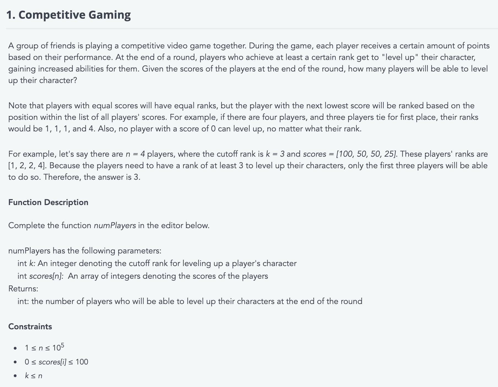
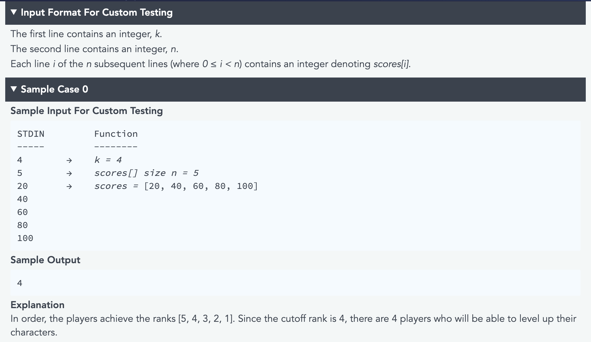
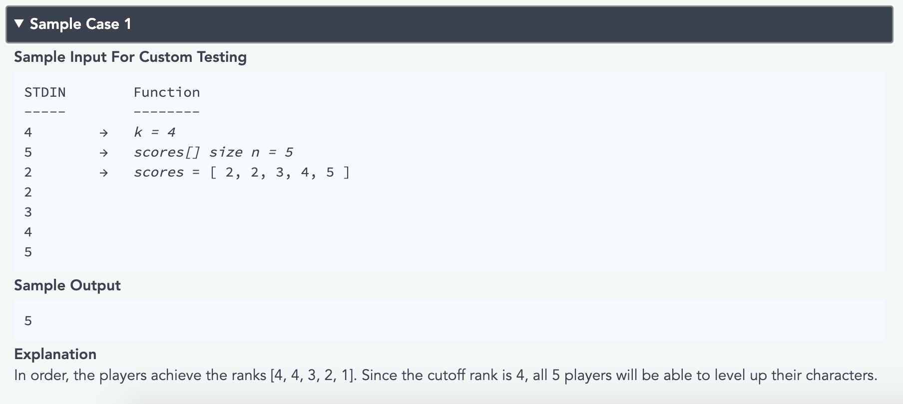

```python
def numPlayers(k, scores):
    answer = []
    rank = 1
    scores.sort(reverse=True)
    
    for idx, num in enumerate(scores):
        if num == scores[idx-1]:
            answer.append((rank-1, num))
        else:
            answer.append((rank, num))
        rank += 1
    return len([i[0] for i in answer if i[0]<=k])

print(numPlayers(3, [40, 20, 60, 60, 80, 100]))
```