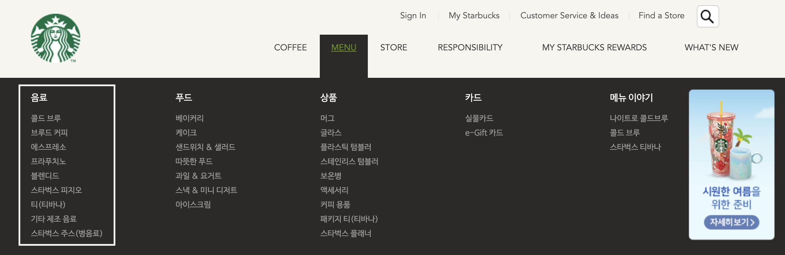
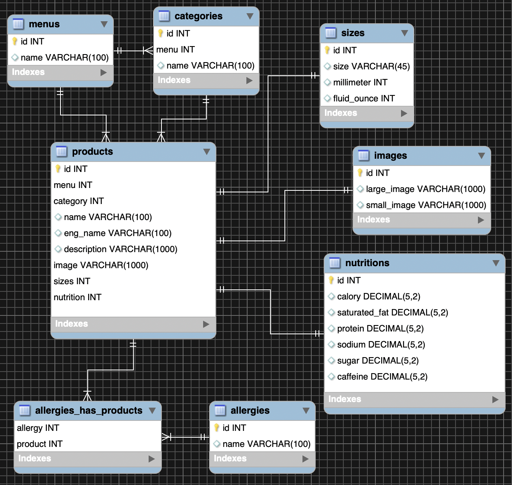

MySQLWorkbench로 위 음료 파트를 모델링 해보았다


menus : 메인 메뉴(음료, 푸드, 상품, 카드, 메뉴 이야기)
categories : 서브 카테고리(콜드 브루, 브루드 커피, 에스프레소 등)
products : 음료 상세정보(속한 카테고리, 음료 이름, 설명, 이미지, 사이즈 등)
size : 음료 사이즈(tall size, 355ml, 12 fl oz)
nutritions : 영양정보
allergies : 알러지 유발 요인

위 테이블을 참고로 짠 장고 모델

```python
from django.db import models


class Menu(models.Model):
    name = models.CharField(max_length=100)

    class Meta:
        db_table = 'menus'


class Category(models.Model):
    menu = models.ForeignKey(Menu, on_delete=models.SET_NULL, null=True)
    name = models.CharField(max_length=100)

    class Meta:
        db_table = 'categories'


class Size(models.Model):
    size = models.CharField(max_length=100)
    millimeter = models.IntegerField(default=0)
    fluid_ounce = models.IntegerField(default=0)

    class Meta:
        db_table = 'sizes'


class Image(models.Model):
    large_image = models.URLField(max_length=1000)
    small_image = models.URLField(max_length=1000)

    class Meta:
        db_table = 'images'


class Allergy(models.Model):
    name = models.CharField(max_length=100)

    class Meta:
        db_table = 'allergies'


class Allergy_To_Product(models.Model):
    allergy = models.ForeignKey(Allergy, on_delete=models.SET_NULL, null=True)
    product = models.ForeignKey('Product', on_delete=models.SET_NULL, null=True)

    class Meta:
        db_table = 'allergy_to_products'


class Product(models.Model):
    menu = models.ForeignKey(Menu, on_delete=models.SET_NULL, null=True)
    category = models.ForeignKey(Category, on_delete=models.SET_NULL, null=True)
    name = models.CharField(max_length=100)
    eng_name = models.CharField(max_length=100)
    description = models.CharField(max_length=1000)
    image = models.ForeignKey(Image, on_delete=models.SET_NULL, null=True)
    allergy = models.ManyToManyField(Allergy, through='Allergy_To_Product')
    size = models.ForeignKey(Size, on_delete=models.SET_NULL, null=True)
    nutrition = models.OneToOneField('Nutrition', on_delete=models.SET_NULL, null=True)

    class Meta:
        db_table = 'products'


class Nutrition(models.Model):
    calory = models.DecimalField(max_digits=5, decimal_places=2)
    saturated_fat = models.DecimalField(max_digits=5, decimal_places=2)
    protein = models.DecimalField(max_digits=5, decimal_places=2)
    sodium = models.DecimalField(max_digits=5, decimal_places=2)
    sugar = models.DecimalField(max_digits=5, decimal_places=2)
    caffeine = models.DecimalField(max_digits=5, decimal_places=2)

    class Meta:
        db_table = 'nutritions'
```