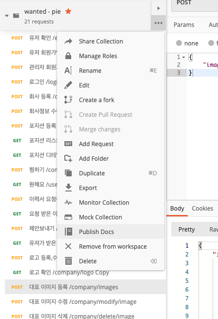
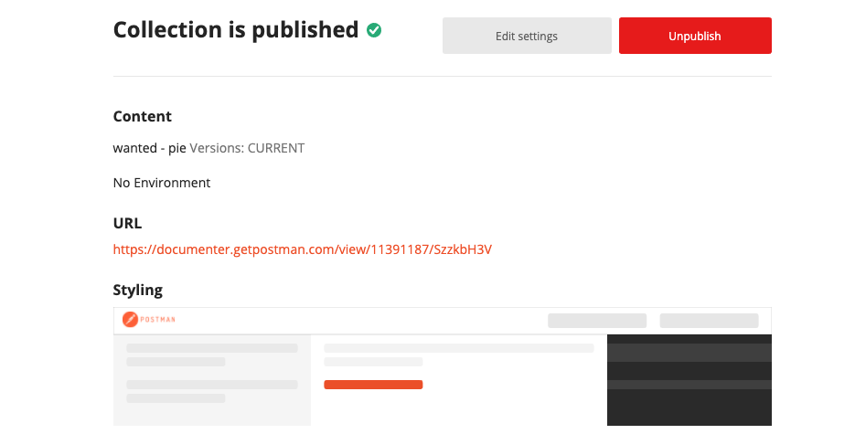
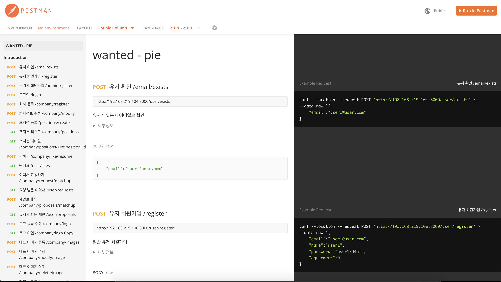
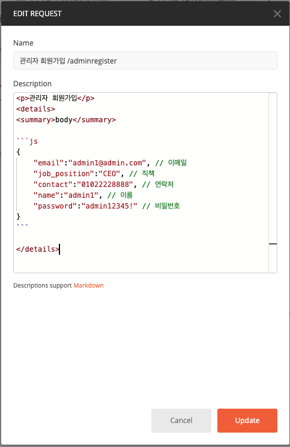

### API Documentation
포스트맨에서 테스트 후 메뉴에서 Publish Docs를 선택 후 URL 클릭






### Template


```python
<p></p>
<details>
<header>header</header>

    {
      "Authorization":"eyJ0eXAiOiJKV1QiLCJhbGciOiJIUzI1NiJ9.eyJpZCI6MX0.Xu9nkS5_9oaa1tTmeaQRsAbqbameCVxsC7Cxdwn_GZo"
    }


<summary>body</summary>

{
    "email":"admin1@admin.com", // 이메일
    "job_position":"CEO", // 직책
    "contact":"01022228888", // 연락처
    "name":"admin1", // 이름
    "password":"admin12345!" // 비밀번호
}

</details>
```