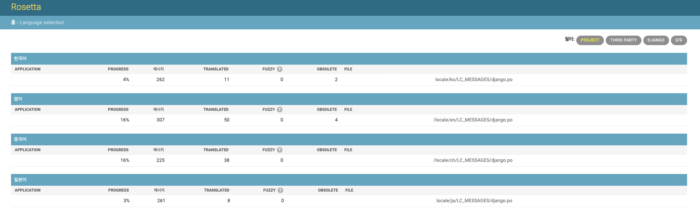

## Rosetta
번역 프로세스를 용이하게 하는 애플리케이션


## Set up

- settings.py

```vim
INSTALLED_APPS += [
    'rosetta',
]
```
- root/urls.py

```vim
if 'rosetta' in settings.INSTALLED_APPS:
    urlpatterns += [
        url(r'^rosetta', include('rosetta.urls'))
    ]
```

## Use

1. http://127.0.0.1:8000/rosetta 링크에 접속해서 변경하면 된다.
  