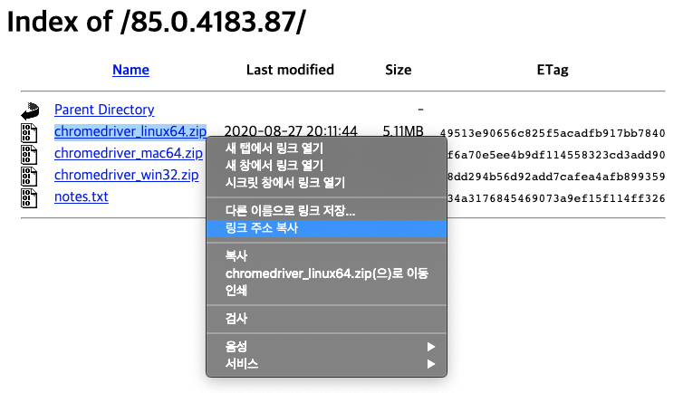

## Chrome 설치 & 버전 확인

```terminal
wget -q -O - https://dl-ssl.google.com/linux/linux_signing_key.pub | sudo apt-key add - 
sudo sh -c 'echo "deb [arch=amd64] http://dl.google.com/linux/chrome/deb/ stable main" >> /etc/apt/sources.list.d/google.list' 
sudo apt-get update 
sudo apt-get install google-chrome-stable
google-chrome --version
```

## 버전에 맞는 크롬 드라이버 다운로드
1. 링크 이동 [ChromeDriver Downloads](https://sites.google.com/a/chromium.org/chromedriver/)
2. 해당 드라이버 링크 주소 복사

3. wget 명령어로 다운로드
```terminal
wget -N https://chromedriver.storage.googleapis.com/85.0.4183.87/chromedriver_linux64.zip
```
4. 압축 해제
```terminal
unzip chromedriver_linux64.zip
```

## 필요한 라이브러리 설치
```terminal
sudo pip install xlrd
sudo apt-get install xvfb
sudo pip install pyvirtualdisplay
```